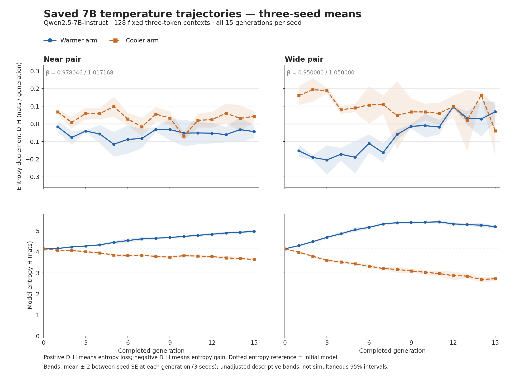
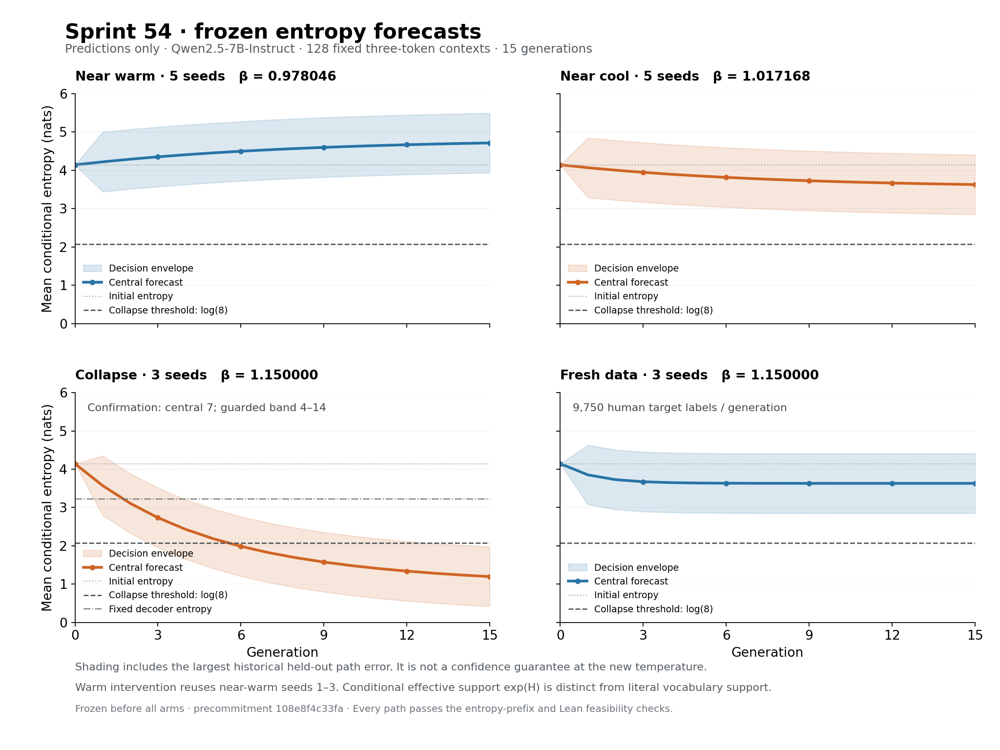
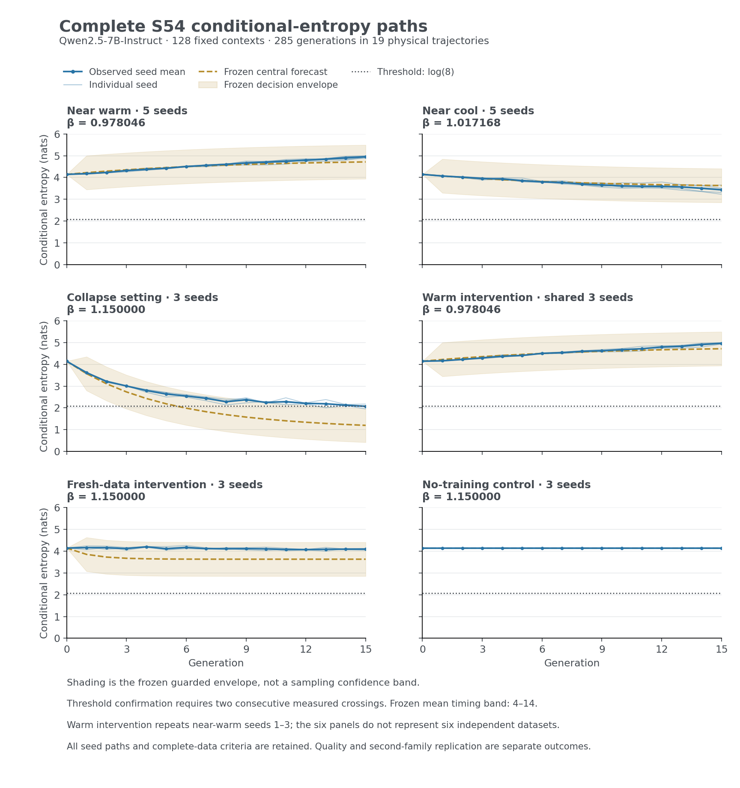
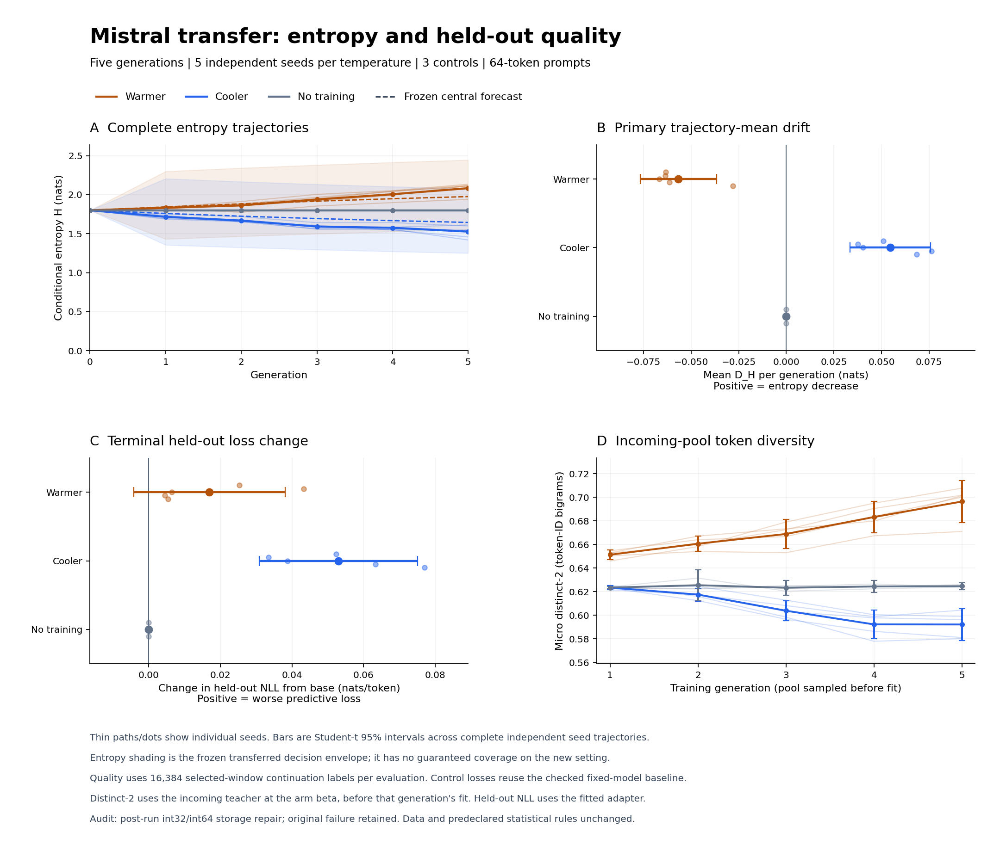
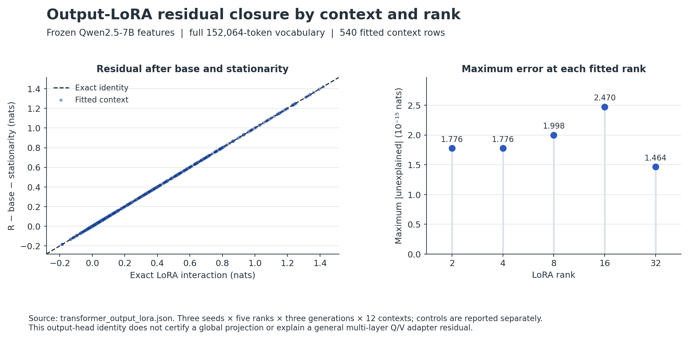
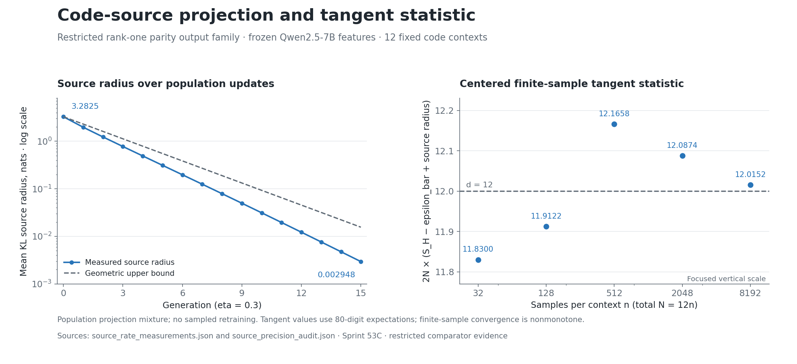
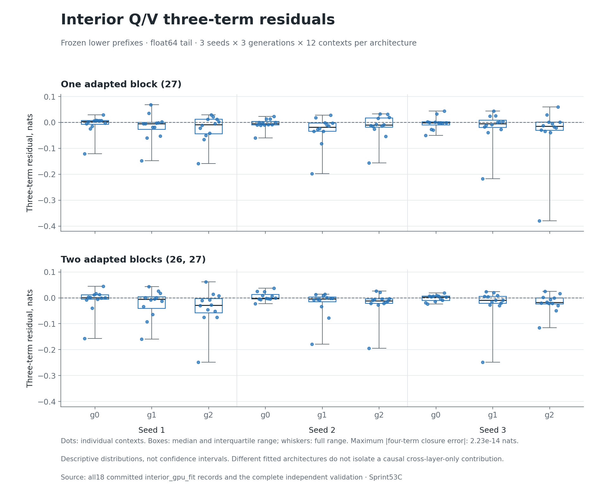

<!--
AQIDA_CONSTITUTIONAL_SCOPE: baseline_or_comparator
AQIDA_ROLE: baseline_or_comparator
THEORY_BINDING_MAP:
- CORE_LOGIC: signed measurements and normalized comparator laws retain scope.
- elm_eulerian: composition retains both factor interaction and feature curvature.
- n_s_u: complete seed trajectories, prospective predictions and mechanism rows.
- e_i/squaring/AQiDA_Physics/Chess_Cybertron: residual and assessment boundaries.
CLAIM_BOUNDARY: comparator only; not AQiDA core logic. Exact conditional theory
and finite measured results do not authorize public priority or universal dynamics.
FALSIFICATION_TESTS: exact sources, independent reconstruction, frozen horizons,
complete adverse gates, standard Lean axioms and visual inspection.
-->

# Frozen temperature predictions in recursive 7B LoRA training

## Abstract

Three completed finite experiments separate entropy-sign prediction, full trajectory prediction, endpoint collapse and predictive quality. Sprint 53C completed 180 generations at the inherited near temperatures and a wider pair. Sprint 54 expanded the decisive near pair to five independent seeds: mean entropy decrement was -0.0537760002 nats per generation in the warmer arm and 0.047313807 in the cooler arm, with both Student-t 95% intervals excluding zero. Its stronger collapse and prevention criterion failed: the beta=1.15 trajectories did not meet the required two-consecutive-generation endpoint by generation 15, and the collapse timing and complete curve gates missed. Both inherited drift directions resolved in S55, and both complete mean entropy curves lay inside their frozen transferred envelopes.

S55 required a separately committed post-run storage-dtype audit repair; the original frozen analyzer failure is preserved and the statistical rules are unchanged. The fresh-dose contrast was measured at one operating point, 3 seeds (+0.138139613 to +0.00334192088 nats per generation); it does not establish prevention against confirmed collapse. The warmer-arm held-out quality result is unresolved in both directions: neither benefit nor harm is resolved. S55 had no death arm. These results establish that entropy stabilization is not quality preservation.

The identities have a separate scope. Frozen-feature output LoRA closes the three named terms at numerical precision; actual interior Q/V probes require a fourth feature-curvature term, already nonzero for one adapted block. A restricted fixed-direction output family supplies positive-radius projection and tangent measurements, while fitted teachers in the same Q/V class have zero source radius by membership. The complete real-loop review leaves the projection, Wilks, Fisher and optimization-rate hypotheses uninstantiated. None of these findings establishes public priority, a universal transformer critical temperature or unconditional collapse dynamics.

## Relation to selected prior work

Temperature and external-data effects have prior theoretical treatments. Marchi and colleagues analyze asymptotic temperature regimes under explicit learning-accuracy assumptions; both concentration and approach to uniformity can represent degeneration in their framework. [Marchi et al. (2024), version2](https://arxiv.org/html/2404.02325v2), sections4–5. Seddik and colleagues analyze recursive categorical estimation and mixtures of real and synthetic data. [Seddik et al. (2024), version1](https://arxiv.org/html/2404.05090v1). Borkar gives source-barycenter and pure-generation collapse results for a measure-valued Markov model. [Borkar (2025), version4](https://arxiv.org/html/2506.09401v4), TheoremsIII.3 andIV.3.

The present experiments address a specified finite horizon, fixed neural conditionals, frozen predictions and explicit optimizer/data budgets. An entropy gain alone does not establish retained task quality; the held-out quality measurement remains separate. The cited model assumptions are not automatically discharged by these neural runs. This is selected related work, not an exhaustive priority assessment, and it authorizes no first-in-field claim.

## Metric, cohort, and uncertainty

Entropy decrement is D_H = H(source) − H(production), in nats per generation. Positive D_H means entropy loss; negative means entropy gain. The entropy increment is its negative. Both 51F raw rows and 53C raw rows use this convention. A positive drift alone is not the future experiment's actual-collapse endpoint.

The 53C population is the fixed Qwen2.5-7B-Instruct revision on 128 predeclared three-token WikiText contexts, weighted uniformly. Each of four settings has three independent fifteen-generation trajectories. Pointwise SE uses three independent seed values. Window SE uses three independent within-seed window averages; it never treats the dependent generations as independent replicates. All windows and all sixty arm-generation means are retained. Source: [step0_saved_analysis.json](../evidence/s54__step0_saved_analysis.json); independent audit: [step0_validation.json](../evidence/s54__step0_validation.json).

## Study sequence and frozen provenance

| Experiment | Physical trajectories | Generations per trajectory | Context | Main decision |
| --- | ---: | ---: | --- | --- |
| S53C, Qwen2.5-7B | 12 | 15 | 128 three-token prompts | Inherited near-sign rule and separate wide-pair backstop |
| S54, Qwen2.5-7B | 19 | 15 | Same 128 three-token prompts | Five-seed near signs; separately gated collapse, intervention, timing and curves |
| S55, Mistral-7B | 13 | 5 | 128 distinct 64-token prompts | Both five-seed drift intervals; complete transferred curves; separate quality |

S54 was frozen at 2026-09-07T07:54:12Z with SHA256 `108e8f4c33fa14e705cc734ae950ffd09685a63929dc9db3ef7faaa8086124b1`. S55 was frozen at 2026-09-09T06:22:34Z with SHA256 `a7bf777d07faba017420e550a66f87d671d3c30409663148e97c7103881aa997`. Its actual launch ancestry contains 2 local commit(s), each checked for the exact original commitment and source files. The inherited exact reference beta_c is 0.9974153735881554; its rounded display 0.9974 is not a recalibration. Filesystem dates and local Git records do not constitute independently timestamped public preregistration.

Sources: [temperature_precommitment.json](../evidence/s53c__temperature_precommitment.json), [precommitment.json](../evidence/s54__precommitment.json), [precommitment.json](../evidence/s55__precommitment.json).

## Near and wide settings have different time profiles

Near-warm drift changes little between the first and last three-generation windows. Wide-warm drift changes sign in the late window. Thus neither constant initial magnitudes nor one universal decay-to-floor story describes all settings. The following means are accompanied by one between-seed SE and are descriptive window comparisons, not separately corrected significance tests.

| Setting | First 3 generations | Last 3 generations | All 15 generations |
| --- | --- | --- | --- |
| near_warm | -0.044422103 ± 0.0026775309 | -0.0454461348 ± 0.0108536099 | -0.0554413844 ± 0.00234163813 |
| near_cool | 0.0453818416 ± 0.00866093981 | 0.0450047663 ± 0.00487110589 | 0.0335894005 ± 0.00133324903 |
| wide_warm | -0.182399772 ± 0.0127385198 | 0.0435163341 ± 0.0200203577 | -0.0703688928 ± 0.0019709901 |
| wide_cool | 0.181459663 ± 0.010789756 | 0.0483111915 ± 0.0490122478 | 0.0946339028 ± 0.00368784924 |

The upper panels show the signed per-generation means; the lower panels show actual mean model entropy, including generation zero. All observations are retained. Bands are pointwise two-SE summaries from three seeds and do not provide simultaneous 95% coverage. The wider warmer trajectory first gains entropy and later loses some of that gain, while its whole-horizon mean decrement remains negative.

## The asymmetry changes with horizon and experiment

The ratio of cooler-arm to warmer-arm absolute mean drift is 2.76382616 in the earlier N2N4 three-generation realization and 0.605854289 over the complete 53C near-pair grid. In the 53C first-three-generation averages the near ratio is 1.02160498; the whole-horizon imbalance is therefore concentrated in the intervening trajectory shape rather than a uniform scale change. The complete wide-pair ratio is 1.3448258, reversing the initial forecast's slightly stronger warmer magnitude. These cross-run comparisons have different seeds; 51F additionally has a different model, context selection and training protocol. They are descriptive, not causal scale comparisons.

## Forecast provenance and the first-generation discrepancy

The 53C precommitment contains a base conditional entropy-price curve and a signed scalar budget inherited from the N2N4 beta=1 calibration. The budget is minus the mean of three calibration drifts: 0.03219706, 0.0553436954, -0.0282555737. The resulting budget is -0.0197617272; the frozen crossing is beta_c = 0.9974153735881554. The inherited threshold was recorded at 2026-09-05T00:23:48Z, and the 53C precommitment at 2026-09-05T02:39:15Z, before the arms. The prearm commit is `7de2927f3916fa24c878179a881fe167ef54b182`.

There is no learned temporal-response model in that precommitment. The initial forecast is the base decoder price minus this calibration budget. At the first generation, the observed decoder prices still equal the frozen base prices to numerical precision, but the observed signed training contributions differ from the calibration budget. Therefore a horizon-averaging explanation alone cannot account for the forecast discrepancy: it is already present at the initial state. The accounting below is exact entropy-ledger algebra, not an independent causal decomposition.

| Setting | Initial forecast | Observed generation 1 mean | Forecast error | Decoder-price change | Signed-budget contribution |
| --- | --- | --- | --- | --- | --- |
| near_warm | -0.153012735 | -0.015898002 | 0.137114733 | 5.27355937e-16 | 0.137114733 |
| near_cool | 0.147260685 | 0.0686043377 | -0.0786563468 | -1.36002321e-15 | -0.0786563468 |
| wide_warm | -0.390764995 | -0.152643753 | 0.238121243 | -6.10622664e-16 | 0.238121243 |
| wide_cool | 0.373835546 | 0.161283976 | -0.21255157 | -5.55111512e-17 | -0.21255157 |

The old sign convention needs clarification, not reversal. The 51F beta=.99 and beta=1.03 raw records satisfy H_p − H_qt = D_H on all 626 stored context rows. Their means are -0.0632773111 and 0.0518754111. The S54 ledger reconciliation records that same convention.

## Retrospective model comparisons do not identify a common floor

Two explicit candidate shapes were compared: a recalibrated constant finite-horizon response, and D_g = c + a rho^g. Each comparison leaves one of the three seeds out; a separate test fits generations 1–10 and evaluates 11–15. Squared errors have units nats squared per generation squared. This is retrospective model selection for a future freeze, not prospective confirmation.

| Setting | Candidate | Leave-one-seed-out MSE | Early-10 / late-5 MSE | Interpretation |
| --- | --- | --- | --- | --- |
| near_warm | constant | 0.00213588275 | 0.00177147295 | Retrospective finite-horizon fit |
| near_warm | decay_plus_floor | 0.00218304719 | 0.0019009772 | Retrospective finite-horizon fit |
| near_cool | constant | 0.00238678455 | 0.00154531648 | Retrospective finite-horizon fit |
| near_cool | decay_plus_floor | 0.00229978341 | 0.00620486581 | Retrospective finite-horizon fit |
| wide_warm | constant | 0.011642176 | 0.0315583305 | Retrospective finite-horizon fit |
| wide_warm | decay_plus_floor | 0.00312958956 | 0.00340674161 | Unidentified floor: decay parameter at upper boundary |
| wide_cool | constant | 0.00812145344 | 0.0133253158 | Retrospective finite-horizon fit |
| wide_cool | decay_plus_floor | 0.00669029732 | 0.0109584118 | Retrospective finite-horizon fit |

The near-warm constant response beats the decay candidate in both checks. Near-cool is mixed: decay-plus-floor slightly improves the leave-one-seed-out error, while constant is better in the early-to-late test. Wide-cool decay improves both error summaries. Wide-warm obtains a better trend fit only by placing rho at its upper search boundary, with a fitted floor of 213.942549; the amplitude cancels that number over the short observed horizon. That asymptotic floor is unidentified and must not be frozen as a physical quantity.

## Retrospective H1/H2 adjudication and the future design rule

The Director now defines H1 as a correct generation-1 forecast followed by geometric decay toward a floor, and H2 as a generation-1 training-side calibration error followed by approximately stable drift. These are retrospective labels supplied after S53C; none changes the frozen forecasts or decision rules.

The near pair is H2-compatible: the first-three and last-three window means are similar, and the forecast discrepancy is already present at generation 1. This is descriptive compatibility, not proof of constant drift or equality of windows. Constant beats decay-plus-floor in both checks only for near-warm; near-cool has the mixed comparison above. Wide-cool is H1-like in its declining shape (about +0.18146 to +0.04831 nats/generation across those windows), but it does not satisfy literal H1: its generation-1 forecast was also wrong. All four frozen initial magnitude forecasts miss at generation 1.

Wide-warm is NEITHER under those two full definitions: it gains about 1.28308 nats, reaches mean H=5.42741405 at generation 11, then reverses sign. A stagnation-ceiling interpretation is S53C retrospective, single family, consistent with S55 only at the level of qualitative finite-horizon behavior. The ceiling mechanism and value are unproven. S56's saved-pool replay distinguishes exp(mean H)=227.560025 from actual conditional sample support: the mean unique next-token counts are 4.94791667 in the incoming peak-generation pool and 4.859375 in the following pool. Neither 227.56 nor this entropy peak identifies the self-sample support or an exact neural support ceiling.

The adopted design rule for every future endpoint, timing and controller-setpoint freeze is a decay-plus-floor/geometric response, never a linear-in-state response. The S53C magnitude and S54 timing/endpoint failures motivate this conservative policy; they do not prove one universal geometric law. A constant response may be retained as the zero-amplitude comparison within the geometric family. Check parameter identifiability, entropy feasibility, complete horizons and prospective uncertainty before freezing. An unidentified floor such as the wide-warm fit cannot become a controller setpoint. Historical frozen files remain unchanged.

## Corrections carried into Sprint 54

1. **Freeze versus ceiling.** A timestamped scalar does not become a valid horizon curve. Holding the wide-cool initial forecast constant violates nonnegative mean entropy at prefix 12. Every future curve and declared bound must pass the entropy telescoping check before any arm starts; infeasible curves are rejected without post-result clipping.
2. **Convention.** Positive D_H is entropy loss in both 51F and 53C. Delta H has the opposite sign. Old language equating any positive drift with actual collapse is replaced by a separate prospective threshold endpoint.
3. **Three versus four terms.** A general-parameter three-term theorem includes the complete curvature remainder. Frozen-feature output LoRA has its exact bilinear correction. Interior effective-weight LoRA retains both factor interaction and a fourth feature-curvature term, which can already be nonzero in one layer.

## Sprint 54 frozen predicts-and-prevents protocol

S54 protocol frozen at 2026-09-07T07:54:12Z; SHA256 `108e8f4c33fa14e705cc734ae950ffd09685a63929dc9db3ef7faaa8086124b1`. 285/285 condition-generations saved in the complete source-bound final audit at 2026-09-09T05:16:14Z. Prearm 232/232; six standard-axiom Lean declarations certify 26 paths/416 entropy values.

The five independent primary seeds run at the same near temperatures and inherited beta_c. All conditions retain the same7B revision,128 three-token contexts,65,536 generated tokens and15-generation horizon. Trained conditions retain150 production updates, rank8/alpha16 Q/V LoRA and19,500 next-token target exposures per generation. The additional150 reference updates and IID diagnostics from53C are omitted. Three CPU fixture seeds reproduce the old first150 losses, production parameters and teacher predictions exactly (30/30 checks); actual7B replay is an additional runtime requirement.

| Logical condition | Beta | Seed count | Predicted H at generation15 | Fresh target labels / generation |
| --- | --- | --- | --- | --- |
| near_warm | 0.978046241 | 5 | 4.71662001 | 0 |
| near_cool | 1.01716809 | 5 | 3.62995853 | 0 |
| collapse | 1.15 | 3 | 1.19802452 | 0 |
| fresh | 1.15 | 3 | 3.63167534 | 9750 |
| warm_intervention | 0.978046241 | 3 | 4.71662001 | 0 |
| no_training | 1.15 | 3 | 4.14433282 | 0 |

These are precommitted predictions, with no observed Sprint54 points. Shading is the guarded decision envelope; it does not supply a coverage guarantee at the extrapolated temperature.

The warm intervention uses the first three near-warm trajectories. It is shared data, with no additional independent replication. Collapse, warm, fresh and untrained conditions deliberately match initialization/sampling/training random-number seeds across conditions; independent seeds within each setting remain the uncertainty unit. There are19 physical trajectories:240 trained generations and45 untrained sampling generations. Saved phase timings forecast 41.975 hours at the median phase timings and 42.954 hours using the90th-percentile phases, including the stated15-second measurement-overhead assumption. Actual runtime is measured separately.

S54 retains two repeated prompt-position labels per synthetic-origin example. Thus each no-new-human-data generation optimizes19,200 generated continuation labels and300 fixed prompt labels. The fresh condition optimizes9,750 new human labels,9,600 generated continuation labels and150 repeated prompt labels. These totals describe label provenance; the legacy sequence-origin field groups the prompt labels with their synthetic-origin example. This is not an unqualified pure synthetic-label theorem instance.

The fresh intervention replaces exactly75 of150 optimizer examples with distinct131-token human sequences, consuming9,750 human next-token labels per generation. The other75 examples use generated sequences. All3,375 human sequences have disjoint source positions across the three seeds and15 generations. The human train split was used for historical context selection; base-model pretraining overlap is unknown. Fresh optimizer targets are not a held-out quality set.

The collapse criterion is mean conditional entropy at or below log(8) for two consecutive measured generations; confirmation occurs on the second. Every collapse seed must meet it by generation15. Both intervention conditions must keep every seed strictly above the threshold at all15 measured generations. Effective support here is exp(mean conditional entropy), not literal nonzero vocabulary size. The fixed untrained model has H=4.14433282; its decoder at beta1.15 has H=3.21923466, above the collapse threshold before any training.

The selected bounded response model evolves the logit of H/log(V), with coefficients [0.0009220352184015205, -0.07213529482929412, -0.11956626099108508]. Selection compared constant, state-dependent linear, quadratic-temperature and temperature/state-interaction candidates on held-out seeds, settings and early-to-late forecasts. The central collapse confirmation prediction is generation7. The decision envelope includes the largest historical held-out complete-path entropy error,0.777851459 nats, and yields a guarded confirmation band of generations4–14. The narrower bootstrap-only timing interval7–8 is recorded separately. Neither interval has a distribution-free coverage guarantee at beta1.15, outside the.95–1.05 calibration range. The proposed fresh response explicitly assumes partial restoration toward the base entropy coordinate and has no prior intervention validation.

All central, pointwise-edge and decision-envelope entropy paths are feasible before the run. Each edge's drift is defined by adjacent entropy differences and telescopes; these edge drifts are not pointwise drift confidence intervals. Lean encodes the416 binary64 entropy values as exact rationals, checks them in[0,7], proves7<log(152064), and proves the generic prefix budget identity. This certifies arithmetic feasibility, not forecast accuracy.

Interpretation proceeds through instrument validity, both five-seed t95 near-sign intervals, actual threshold collapse, both interventions holding, then complete curve/timing/control checks. The laboratory predicts-and-prevents wording is authorized only if every stated gate passes. Weaker sign criteria and all negative outcomes remain visible. Field priority, a universal transformer drift theorem and quality preservation are not authorized by this protocol. Frozen record: [precommitment.json](../evidence/s54__precommitment.json); prearm audit: `tools/band1_export/s54/prearm_validation.json` (local source artifact; not bundled); kernel audit: `tools/band1_export/s54/kernel_gate_prearm.json` (local source artifact; not bundled).

## Sprint 54 complete prospective result

The complete S54 dataset passes its instrument audit, but the full laboratory predicts-and-prevents claim is REFUSED. The earlier Path-A "~90%, in flight" completion estimate was itself falsified: the predeclared prevention-against-confirmed-collapse form failed. The surviving measured core is sign replication, transferred curves, matched controls and the dose contrast at one operating point; it is not the claimed prevention endpoint.

All 285 generations in 19 physical trajectories are present. The frozen final validator passed 3912/3912 checks at 2026-09-09T05:16:14Z. Negative scientific gates remain valid experimental findings.

| Predeclared criterion | Complete-data result |
| --- | --- |
| Complete instrument and artifact checks | PASS |
| Both five-seed near-sign t95 intervals | PASS |
| Inherited warmer-two-SE and cooler-sign rule | PASS |
| Both near-sign two-SE intervals | PASS |
| All three collapse seeds cross the threshold | FAIL |
| Mean collapse confirmation lies in the frozen timing band | FAIL |
| Every warm and fresh seed stays above the threshold | PASS |
| Every complete logical-condition mean curve lies in its frozen envelope | FAIL |
| No-training control retains zero trained-loop drift | PASS |

The primary near-temperature decision uses both five-seed Student-t95 intervals (four degrees of freedom). The inherited warmer-two-SE/cooler-sign rule and the both-two-SE rule are reported separately. Generations within a trajectory do not increase the independent seed count.

| Logical condition | Independent seeds | Mean D_H (nats/generation) | Between-seed SE | Student-t95 interval |
| --- | ---: | ---: | ---: | --- |
| near_warm | 5 | -0.0537760002 | 0.00125881097 | [-0.0572710198, -0.0502809807] |
| near_cool | 5 | 0.047313807 | 0.00495606215 | [0.0335535725, 0.0610740415] |
| collapse | 3 | 0.138139613 | 0.00441858091 | [0.119127993, 0.157151232] |
| warm_intervention | 3 | -0.0548558391 | 0.00132592537 | [-0.0605608355, -0.0491508426] |
| fresh | 3 | 0.00334192088 | 0.00167926844 | [-0.00388338807, 0.0105672298] |
| no_training | 3 | 0 | 0 | [0, 0] |

D_H = H(source) − H(production); positive values mean entropy loss. Warm intervention reuses the first three near-warm trajectories and supplies no additional independent replication. The three-seed intervals are descriptive secondary results.

The fixed collapse threshold is 2.07944154 nats. Confirmation requires two consecutive measured generations at or below it and is recorded at the second generation. The frozen decision band for the three-seed mean confirmation is 4–14. A seed with no confirmation is reported explicitly.

| Logical condition | Seed confirmation generations | Mean confirmation | Every seed stays above threshold | Maximum central-curve error (nats) | Entire mean curve inside frozen envelope |
| --- | --- | --- | --- | ---: | --- |
| near_warm | none through 15, none through 15, none through 15, none through 15, none through 15 | none through 15 | yes | 0.234352812 | yes |
| near_cool | none through 15, none through 15, none through 15, none through 15, none through 15 | none through 15 | yes | 0.195332818 | yes |
| collapse | none through 15, none through 15, none through 15 | none through 15 | no | 0.90350343 | no |
| warm_intervention | none through 15, none through 15, none through 15 | none through 15 | yes | 0.250550394 | yes |
| fresh | none through 15, none through 15, none through 15 | none through 15 | yes | 0.549647149 | yes |
| no_training | none through 15, none through 15, none through 15 | none through 15 | yes | 0 | yes |

Prevention requires observed collapse in the matched collapse arm as well as both interventions holding. Curve and timing failures cannot be replaced by a successful entropy-sign result. These measurements concern fixed-context conditional entropy, with repeated prompt labels disclosed in the training accounting; quality preservation, a second model family, field priority, a positive global adapter radius and a transformer Fisher lower bound are not established by this experiment.

The terminal collapse-arm mean entropy is 2.07223863 nats, below the fixed threshold 2.07944154; this isolated terminal mean does not satisfy the two-consecutive-measurement rule. None of the three seeds has a confirmed endpoint. The individual seed 2 crossings at generations 13 and 15 are separated by a rebound at 14. No generation 16 is imputed or used. Interventions holding therefore does not establish prevention against a confirmed matched collapse.

## Sprint 55 design and transfer boundary

The pinned second family is `mistralai/Mistral-7B-Instruct-v0.3` at revision `c170c708c41dac9275d15a8fff4eca08d52bab71`. It uses 64-token prompts, 128-token continuations, 512 generated sequences per generation and 150 AdamW production updates. Rank-8 Q/V adapters use alpha 16; each fit resets to its own trajectory initialization. All 19,200 training labels per generation are continuation labels. Prompt labels are excluded, unlike the disclosed repeated prompt labels in S54.

The transfer recipe was recorded before observing Mistral's untouched base. The base observation measured training-prompt conditionals without training, generation or test-quality evaluation. The deterministic compiler then produced the complete numerical paths before either arm. The inherited temperature pair, response coefficients and envelopes were not refitted to S54 outcomes or Mistral quality. The actual S55 certificate checked 9 paths, 54 entropy values and 45 adjacent drifts in Lean; this establishes finite feasibility, not forecast accuracy.

## Sprint 55: completed transfer and quality measurements

Both inherited drift directions resolved in S55, and both complete mean entropy curves lay inside their frozen transferred envelopes.

The post-run repaired instrument audit passed 5,003 checks at 2026-09-10T10:32:53Z. It includes 65 generations in 13 independent trajectories: five warmer seeds, five cooler seeds and three no-training controls. Each trajectory has five dependent generations. The primary uncertainty unit is the complete seed trajectory, using Student-t 95% intervals with four degrees of freedom for each temperature.

The original frozen analyzer failed before computing aggregate statistics: it required int64 on-disk tokens although the precommitted preparation producer saved int32. The prepared context and held-out arrays match their original precommitment hashes exactly. The original FAIL_INSTRUMENT receipt and analyzer remain preserved. A separately committed post-run repair changes exactly one storage-width predicate to accept matching signed int32 or int64; all original shape, range, probability, provenance, teacher-chain, sample-budget, seed-interval and verdict rules remain in force. Twenty focused regression checks preceded the repaired aggregate analysis. This is a post-run software-repaired instrument result under unchanged predeclared statistical rules; the original frozen instrument did not pass.

The untouched mean entropy is 1.80014327 nats and baseline held-out NLL is 2.12520693 nats/token. Positive D_H denotes entropy loss; negative D_H denotes entropy gain.

| Condition | Seeds | Mean D_H per generation | Between-seed SE | Student-t 95% interval | Terminal mean H | Entire mean path inside transferred envelope |
| --- | ---: | ---: | ---: | --- | ---: | --- |
| Warmer | 5 | -0.0566458836 | 0.00719345914 | [-0.076618128, -0.0366736392] | 2.08337269 | yes |
| Cooler | 5 | 0.0546631442 | 0.00763266048 | [0.0334714814, 0.075854807] | 1.52682755 | yes |
| No training | 3 | 0 | 0 | [0, 0] | 1.80014327 | no |

The exact envelope diagnostics retain a floating-point boundary effect: independently reconstructed initial entropy differs from the frozen initial value by 2.22e-16 nats. Initial flags and the zero-width control path therefore fail exact containment. The frozen near-arm curve decision uses the five postinitial points; the separate control gate uses its original 1e-8 tolerance and passes. No envelope or tolerance was altered.

Quality uses 128 separate test windows, each with 64 context tokens and 128 continuation labels: 16,384 evaluated labels per trained-generation evaluation. It is selected-window perplexity, not full-corpus WikiText benchmark perplexity. Positive NLL change means worse predictive loss. Distinct-2 counts token-ID bigrams within generated continuations, excluding prompts and cross-sequence pairs.

Held-out NLL is measured on the newly fitted production adapter at generation g. Distinct-2 instead describes the incoming training pool sampled from the preceding teacher at that arm's beta, before the generation-g fit. Thus generation-five distinct-2 uses the generation-four teacher; the final generation-five adapter receives no additional diversity sample. These are different measurement stages.

| Condition | Terminal NLL | NLL change from base, mean | Student-t 95% interval for change | Frozen quality interpretation | Perplexity of mean NLL | Generation-5 incoming pool distinct-2, mean |
| --- | ---: | ---: | --- | --- | ---: | ---: |
| Warmer | 2.14214745 | 0.0169405177 | [-0.00424519831, 0.0381262338] | Change unresolved | 8.51770936 | 0.696352116 |
| Cooler | 2.17819535 | 0.052988421 | [0.0308225407, 0.0751543014] | Increase resolved | 8.8303562 | 0.59210753 |
| No training | 2.12520693 | 0 | [0, 0] | Change unresolved | 8.37463029 | 0.624584769 |

The warmer-arm quality result is unresolved in both directions: the interval does not resolve benefit or harm, and it does not establish quality equivalence. Control entropy and losses reuse the baseline after exact parameter checks; control samples and distinct-2 are newly observed. Repeated stored control losses are not independent model forward evaluations. The independent audit reconstructs saved per-example loss arithmetic without repeating held-out forward passes.

The fixed-model control passed. S55 had no death arm. It retains the inherited Qwen reference beta_c=0.9974153735881554 and 1.04 temperature ratio; it does not estimate a new Mistral critical point. Family, context length and prompt-label policy change together. Complete transferred envelopes have no guaranteed coverage on the new setting, and S54's log8 collapse endpoint is not applied here. No quality-equivalence, isolated architecture, actual-collapse or public-priority claim is authorized.

## Frozen-feature output-LoRA term closure

The synthetic suite and the **real 7B frozen-feature output-head suite** close the residual per context. The real suite uses all 152064 output tokens and the actual 3584-dimensional final hidden states on 12 declared WikiText contexts, with ranks [2, 4, 8, 16, 32], three generations, and seeds [11, 23, 37]. There are 660 recorded rows including controls. Maximum unexplained residual: **2.47024623e-15 nats**. The independent directional finite-difference error is 1.32382472e-09; the separately computed gradient-dot discrepancy is 2.22044605e-16.

| Rank | Mean KL to fit | Mean residual R | Mean base | Mean stationarity | Mean exact interaction | Maximum absolute unexplained |
| --- | --- | --- | --- | --- | --- | --- |
| 2 | 0.623666363 | -0.20167378 | 0.00212319113 | -0.592828225 | 0.389031254 | 1.77635684e-15 |
| 4 | 0.560840152 | -0.279397146 | -0.00417462088 | -0.671165705 | 0.395943179 | 1.77635684e-15 |
| 8 | 0.607743029 | -0.284963253 | 0.0131041398 | -0.649169774 | 0.351102381 | 1.99840144e-15 |
| 16 | 0.826596777 | -0.239746732 | 0.0261818855 | -0.537929797 | 0.272001179 | 2.47024623e-15 |
| 32 | 1.25670822 | -0.0459195768 | -0.00480291559 | -0.0713248365 | 0.0302081753 | 1.46410661e-15 |

The table reports aggregates for scanning; the closure verdict checks the per-context rows in `tools/band1_export/n1n3_n2n4/transformer_output_lora.json` (local source artifact; not bundled). `epsilon_fit_KL` is the exact KL to the finite fitted predictor. It is **not certified as the infimum over the model class**. The identity holds at every finite parameter value, so optimality is not needed to test term closure.

Output-head fitting and term evaluation use float64 arithmetic on the cached real hidden states. The multilayer Q/V temperature loop uses NF4 weights and bfloat16 model computation. The near-machine-precision closure is scoped to the explicitly evaluated float64 output-head model.

The consistent-gauge matched-update control changes the rank representation while preserving the effective full and cross updates. Its maximum correction discrepancy is 2.16840434e-19. The matched-factor-path-energy control keeps the endpoint law fixed while the cross correction follows inverse rank; the maximum discrepancy after multiplying by rank is 3.25260652e-18. This second control also demonstrates that matching the full effective update alone does not determine the interaction for different reference factor paths.

`tools/band1_export/n1n3_n2n4/base_feature_provenance.json` (local source artifact; not bundled) independently checks that the original and fresh 7B extractions have identical probability, log-probability, and hidden-state arrays and identical contexts. It records array-value hashes separately from the compressed archive hash, so ZIP metadata is not mistaken for a changed model output.

The first fixed-step fit became numerically unstable on raw transformer hidden states. `tools/band1_export/n1n3_n2n4/output_lora_fixed_step_falsifier.json` (local source artifact; not bundled) reproduces that failure. The final measurement uses declared full-batch Armijo backtracking; the loss traces, accepted step sizes, and backtrack counts are retained. A later system-memory failure is retained in the attempt log, and the final instrument checkpoints completed generations.

**Architectural boundary:** this is an output-head LoRA on frozen 7B hidden features. The temperature loop uses Q/V adapters throughout the transformer. The output-head closure does not, by itself, explain the historical multi-layer 0.90 ratio or certify its feature-curvature term. Neither a universal ratio nor completion of the general multi-layer identification chain is authorized.

## Restricted source-class rate measurements

**Cross-domain source and exact class.**The finite source is tokenized public CPython code from [commit de54cf5](https://github.com/python/cpython/tree/de54cf5be371a6f5e2e9f208c38def5f81d3ef02): `Lib/ast.py`, `Lib/json/decoder.py` and `Lib/tokenize.py`, with its license retained. There are 22,843 corpus tokens and twelve fixed three-token contexts. The declared initial conditional law is 95% empirical code and 5% the actual frozen 7B base law. It is a finite corpus/model mixture, not a claim about the population of all code. Sources: `tools/band1_export/s53c/code_source_manifest.json` (local source artifact; not bundled) and `tools/band1_export/s53c/source_rate_precommitment.json` (local source artifact; not bundled).

The comparator is a rank-one output-logit adapter with a fixed token-parity direction. It changes each context's two group masses while preserving the base proportions within each group. The twelve observed 7B hidden-feature rows have an exact rational right-inverse certificate, so twelve group-logit coordinates are independently realizable. The identifiable dimension is 12; neither the rank nor the ambient parameter count is substituted for tangent dimension. The numerical rational certificate is checked separately from the general kernel theorem conditional on a right inverse.

The global I-projection matches the source's group masses. The KL partition identity proves global optimality across the entire declared positive group-mass family. Consequently the initial source radii are strictly positive in all twelve contexts. This class is narrower than unrestricted output LoRA and differs from the Q/V class in the temperature experiment. Its exact context realizer supplies no neural generalization claim.

The update is explicitly p_(t+1) = 0.7 p_t + 0.3 projection(p_t). It is a population projection mixture. Independent full-vector reconstruction verifies eta=0.3 and its geometric upper bound. Population projection optimization error is zero by the analytic optimizer; a stochastic optimizer noise floor is not measured by this suite. Mean source radius decreases from 3.282504833 to 0.002947713555 nats. The geometric law is an upper bound, not an asserted equality rate.

The ratio of consecutive mean radii ranges from 0.6004398182 to 0.6340983038 over the fifteen updates, below the 0.7 upper factor. The final mean radius 0.002947713555 is below the accumulated geometric bound 0.0155838936 nats. These are ratios of context-averaged radii, not an average of per-context ratios or a stochastic training-rate estimate.

Each context has n=128 independent categorical samples for the per-generation expectation calculation, for total stratified N=1536. The finite entropy and empirical-projection expectations are independently evaluated from binomial marginals, then checked against direct multinomial samples. Empirical projections with a missing group lie on the class closure; the measured KL is not described as a finite-logit attained MLE in that case.

| Generation | Source radius | S_H | Expected empirical-projection KL | 2N(S_H − epsilon_bar) | 2N(S_H − epsilon_bar + radius) |
| --- | --- | --- | --- | --- | --- |
| 0 | 3.282504833 | 0.1923660582 | 3.470993209 | -10071.94261 | 11.91224116 |
| 1 | 1.970946605 | 0.5988896775 | 2.5659586 | -6042.83573 | 11.91224116 |
| 5 | 0.3116064251 | 1.079314046 | 1.387042789 | -945.3426966 | 11.91224116 |
| 10 | 0.0312514857 | 1.171400509 | 1.198774312 | -84.0923229 | 11.91224116 |
| 15 | 0.002947713555 | 1.179941576 | 1.179011607 | 2.856865115 | 11.91224116 |

At fixed positive misspecification the uncentered sampling-minus-projection quantity includes minus the source radius. The finite identity is S_H − epsilon_bar = −radius + the two-group sampling gap. Adding the independently measured radius exposes the tangent term. A separately measured correctly specified projected-source control has radius zero and supports the usual uncentered floor. The source injection is explicit, and no signed budget is renamed as a radius.

| Samples per context | Total stratified N | High-precision centered tangent statistic | Largest original float64 discrepancy, nats |
| --- | --- | --- | --- |
| 32 | 384 | 11.83001087 | 4.494836145e-15 |
| 128 | 1536 | 11.91224116 | 1.36089915e-14 |
| 512 | 6144 | 12.16583026 | 4.757972633e-14 |
| 2048 | 24576 | 12.08739669 | 7.904255115e-13 |
| 8192 | 98304 | 12.0152008 | 4.788562054e-12 |

At n=8192 the high-precision statistic is 12.015200802599, approaching d=12. This is finite numerical evidence, not a newly asserted universal Wilks instance. The original float64 result differs by about 9.4e-7 after multiplication by 2N, corresponding to 4.79e-12 nats. The 80-digit full recurrence normalizes to roughly 1e-79. The initial validation's three scaled-tolerance failures are preserved; the final check propagates the already frozen 2e-11-nat tolerance through the multiplication by 2N. The frozen instrument and its result file were not changed. See `tools/band1_export/s53c/source_validation_initial.json` (local source artifact; not bundled), `tools/band1_export/s53c/source_precision_audit.json` (local source artifact; not bundled) and `tools/band1_export/s53c/source_validation.json` (local source artifact; not bundled).

Changing the initial corpus alone does not keep subsequent self-training sources outside the fitting class: a fitted student used as the next source is a member, hence its source radius is zero. Lower-rank nesting gives a non-strict radius ordering; nonmembership without closedness need not give positive infimum distance. Those obstructions are kernelized or explicitly falsified. Global empirical projection, true optimizer gap and identifiable tangent geometry for unrestricted nonconvex Q/V fitting remain uncertified.

The secondary source audit also tests unrestricted rank-one output-logit updates, allowing the output direction to train. Its protocol was committed at `04f44f53d661e812ce0558568b3d9c21be79e522` before the audit. It selected one initial-state log-odds minor over 948,090 candidates and held that same witness fixed across all sixteen source states: contexts [4, 8], token IDs [69751, 90313] relative to token 0. The minor changes from -250.5248691 to -49.99430319; its units are squared log odds, not KL nats. All 80/120-digit outward-rounded intervals exclude zero and contain the independent 160-digit calculation. The independent audit passes 130/130 checks. Sixteen random full-vocabulary rank-one controls have a largest rounding residual of 4.493e-16.

The corresponding kernel statements establish that rank-one updates have a zero log-odds minor and that normalization leaves the diagnostic unchanged. The numerical decimal witnesses are separate from those conditional Lean statements; they are not literal Lean proofs about the stored logarithms. The outward enclosure uses [Python Decimal's documented logarithm rounding](https://docs.python.org/3.12/library/decimal.html#decimal.Decimal.ln), with directed arithmetic and adjacent representable endpoints.

This supplies numerical evidence of nonmembership in the broader trainable-direction rank-one family. It does not supply its global KL projection, a positive numerical KL lower bound, or its tangent/rate quantities. The exact radius curve and dimension12 remain attached to the fixed-direction family. Evidence: `tools/band1_export/s53c/rank_one_source_measurements.json` (local source artifact; not bundled) and `tools/band1_export/s53c/rank_one_source_validation.json` (local source artifact; not bundled).

| Adapter family | Source-class evidence | Authorized rate/floor scope |
| --- | --- | --- |
| Fixed parity direction, rank-one output adapter | Exact partition projection; positive measured source radius | The reported population contraction and centered d=12 statistic |
| Trainable-direction rank-one output adapter | Nonzero log-odds witness in all sixteen source states | Global projection, exact radius and tangent/rate quantities remain uncertified |
| Interior Q/V family in the temperature loop | Fitted teacher used as next source belongs to the same class | Membership gives radius zero; the output-family rate result is not transferred |

## Interior Q/V closure and measured curvature

It uses the actual last block (27) and last two blocks (26,27), twelve WikiText contexts, rank-8/alpha-16 Q/V adapters, three independent seeds, three sampling generations and 120 full-batch Armijo steps per fit. Frozen lower-layer prefixes and dequantized coefficients are evaluated in float64, including RMS normalization and attention probabilities. It uses the full 152,064-token output head. It is not claimed to reproduce bfloat16 arithmetic or to cover simultaneous adaptation of all 28 blocks.

For effective weights W0,W1, endpoint residual e=q-r and same-module factor cross update C, the instrument measures base transport, actual factor stationarity, and the propagated interaction −<e,J_F(W1)[C]>. The remaining term is <e,F(W1)−F(W0)−J_F(W1)[W1−W0]>. Separate parameter gradients and auxiliary effective-weight directions check the factor identity. The fourth term must close the entropy residual; the unexplained three-term residual measures curvature. A single nonlinear layer can already have nonzero curvature, so a single-layer failure is not automatically a cross-layer-only effect.

Controls retain zero updates and a fixed initial A factor. A predeclared subset uses finite differences and 8/16-point path integration with endpoint e held fixed. The streamed linear operator agrees with dense arithmetic and its backward calculation within 7.11e-15; a small reference Qwen layer agrees in output and input gradient within 9.13e-8, with the float32/float64 distinction explicit. The current fit count is 18/18. The latest independent audit covers 18 complete fits and passes 457/457 checks. Protocol: `tools/band1_export/s53c/interior_gpu_precommitment.json` (local source artifact; not bundled).

| Architecture | Complete fits | Fitted context rows | Minimum three-term residual, nats | Maximum three-term residual, nats | Residual RMS, nats | Max absolute four-term closure, nats | Max base log-probability difference from inherited NF4 execution |
| --- | --- | --- | --- | --- | --- | --- | --- |
| single | 9 | 108 | -0.3800043451 | 0.06841041058 | 0.0599847542 | 2.227992096e-14 | 0.2059217677 |
| multiple | 9 | 108 | -0.2490156628 | 0.06151265782 | 0.05491113534 | 2.138285209e-14 | 0.7008428173 |

All eighteen saved adapter checkpoints also pass the unchanged frozen runner's entropy replay within its 2e-9-nat tolerance, without retraining. The original completion records are preserved, all fit/checkpoint bytes remain unchanged, and the replay audit passes 63/63 checks. It does not record a smaller numerical maximum. Evidence: `tools/band1_export/s53c/interior_replay_gate.json` (local source artifact; not bundled).

These are descriptive residuals over the completed finite context/seed/generation grid. The fourth term has an independent endpoint-direction calculation and predeclared path controls; it is not fitted to eliminate the residual. The optimizer runs to its frozen step budget and need not attain stationarity, so the measured stationarity term remains explicit. The maximum log-probability difference quantifies the boundary between the float64 tail and inherited NF4/bfloat16 execution. Comparing the last-one-block and last-two-block grids does not isolate a causal cross-layer-only contribution. The complete-grid independent audit governs the finite closure/residual claim.

## Post-S54 rate and optimization interface review

The post-S54 real-loop interface review is complete, with 39112/39112 provenance/semantic checks and 718/718 independent reconstruction checks. All 36,480 context-generation rows retain zero untempered source radius by membership in the same fixed-base Q/V adapter class. The 28,672 defined fixed-base direction fits include 15,558 coefficients outside [0,1]; undefined directions remain missing. These diagnostics do not identify theorem damping or a positive-radius contraction. The real-transformer projection, Wilks, Fisher and optimization-rate interfaces remain uninstantiated, with their exact missing hypotheses recorded. No new model observation or Lean declaration was introduced.

| Condition | Independent seeds | Fixed-base direction coefficient, mean ± SE | Relative vector residual, mean ± SE | Final KL to fixed base, mean ± SE |
| --- | --- | --- | --- | --- |
| near_warm | 5 | -0.0591030034 ± 0.00292150487 | 0.735178024 ± 0.00208403079 | 0.128727697 ± 0.00588428006 |
| near_cool | 5 | 0.0614038065 ± 0.0196836513 | 0.721351713 ± 0.00266782195 | 0.0722179517 ± 0.012377186 |
| collapse | 3 | -0.111836295 ± 0.00601369598 | 0.659861154 ± 0.00720914022 | 0.728548599 ± 0.0636236163 |
| fresh | 3 | 0.0406131668 ± 0.000861071132 | 0.746577133 ± 0.00260852003 | 0.193735095 ± 0.0138086625 |
| no_training | 3 | Undefined | Undefined | 0 ± 0 |

The direction coefficient fits the full probability update against the direction from the current untempered teacher to the fixed base. The relative residual is the norm of the remaining vector divided by the actual update norm. Each seed is first averaged over its defined context-generation rows (generations 2–15 for trained conditions); SE is then computed across the independent seed means. Generation 1 and all fixed-model control directions are undefined because teacher and base coincide. Final KL uses generation 15. These are descriptive finite-horizon diagnostics with no predeclared rate-significance claim. They reject this simple fixed-base mixture description as an exact account; they do not exclude every possible projection mechanism.

| Existing interface | Established evidence | Missing hypotheses and claim boundary |
| --- | --- | --- |
| dampedIProjection_* | Untempered source and next fitted teacher are in the same fixed-base rank-8 Q/V class. Source radius is zero by membership. | A positive source radius, certified projection or approximation gap, and an actual convex-mixture update with identified damping are not supplied. Fixed-base KL is a singleton-family diagnostic. Its least-squares vector coefficient is not theorem eta. Tempered decoder and fresh training-label mixture are different objects from the untempered teacher. |
| WilksIProjectionInterface | Recorded null projection expectation and tangent dimension are retained across the complete grid. | The two expectation limits, identifiable tangent dimension, regularity and optimizer asymptotic are not established by this single token budget. Autoregressive tokens and dependent generations are not independent fixed-law categorical replications. Parameter count is not tangent dimension. |
| FisherBand / affineSoftmax_gradientDescent_linear | The actual implementation uses interior Q/V LoRA and AdamW, with each fit reset to its trajectory initialization. | An affine logit family on the required convex region, positive covariance bounds, stationary comparison point and exact gradient-descent update are not certified. The existing theorem remains conditional. No full-transformer Fisher lower bound is inferred from entropy-sign success. |
| LinearOptimisationConvergenceToFloor / sgd_noiseFloor_recurrence | All 240 trained generations retain 150 changing-example losses and their sampling schedules. | Loss excess relative to the same empirical optimum, uniform exponential envelope, attainable floor or a justified SGD expectation recurrence is not measured. These online losses do not identify an optimization rate or floor. A one-sided upper envelope cannot establish an unavoidable error lower bound. |

The entropy response coefficient is a different observable. The same-class radius remains zero regardless of the teacher's training domain; the tempered decoder and the mixture of optimizer labels must be named separately. All 36,000 saved online loss values come from changing examples in 240 fits. They do not measure loss excess relative to a fixed empirical optimum and cannot identify an attained optimization floor. The existing conditional theorems and their audited sources remain unchanged.

Evidence: `tools/band1_export/s54/post_s54_interfaces/interface_review.json` (local source artifact; not bundled) and `tools/band1_export/s54/post_s54_interfaces/validation.json` (local source artifact; not bundled).

## Retained execution interruptions and verified resumption

A Windows restart followed the last original resource observation at 2026-09-09T08:29:13Z; the separately observed next boot was 2026-09-09T08:34:28.408886+00:00. The original worker's exit code and shutdown cause were not observed. Its original logs retain that gap. The preserved 11 completed generations passed the 1,001-check saved-prefix audit. A later live-worker receipt verified the actual frozen runner's checkpoint replay for 3 retained trajectories, unchanged completed records, original sampling/training seeds and runtime ancestry. That receipt checker performed no additional model forward pass and supplied no independent statistical replication. The verified resumed runtime is retained in the completed execution's ancestry. Evidence: `tools/band1_export/s55/host_restart_20260909/capture.json` (local source artifact; not bundled), `tools/band1_export/s55/host_restart_20260909/validation.json` (local source artifact; not bundled), `tools/band1_export/s55/host_restart_20260909/resumption.json` (local source artifact; not bundled). The original independent receipt checker could not read the one-byte run.lock file while the Windows supervisor held its exclusive lock. The revised checker verified the retained byte and live file size and excluded only the live coordinator payload read; every scientific sample, checkpoint, conditional and trajectory check remained in place. The retained earlier guard applies to the original checker; the later revision has its own successful actual resumption receipt. Revision evidence: `tools/band1_export/s55/resumption_lock_revision/revision.json` (local source artifact; not bundled).

Queued supervisor 10876 was later observed absent. Its unchanged record contains no worker launch or observed exit code. No later boot or particular shutdown cause is inferred. The capture verified all 72 earlier saved files unchanged. This waiting interval supplied no completed generation or independent replication. Evidence: `tools/band1_export/s55/queue_absence_20260910_0047/capture.json` (local source artifact; not bundled).

Queued supervisor 26692 was later observed absent. Its unchanged record contains no worker launch or observed exit code. A later boot at 2026-09-09T19:38:46.215270+00:00 was observed. The capture verified all 72 earlier saved files unchanged. This waiting interval supplied no completed generation or independent replication. Evidence: `tools/band1_export/s55/queue_restart_20260909_1938/capture.json` (local source artifact; not bundled).

A later launch, worker 19188, stopped during model loading with observed exit 3221225477 (0xC0000005). Matched Windows evidence names torch_cpu.dll; the underlying cause remains undetermined. No new runtime or sampled generation was written, and the capture verified 72 saved files unchanged. The supplementary memory observer did not start on this attempt; that observation gap is retained. The next launch enabled Python fault-handler tracing for its supervisor and child only, with no numerical or dependency change. The subsequent successful replay does not establish that tracing fixed the earlier crash. Evidence: `tools/band1_export/s55/model_load_failure_20260910_0055/capture.json` (local source artifact; not bundled).

## Reproducibility and release scope

The local source package contains 22 files (82,097 bytes), SHA256 `91a7e914356d74bd31a7264c3f6045a8eebad30923c32ad8abba4dea8fb7923f`. Its portable CPU self-test with the disclosed compatible analyzer passed 39/39 after extraction into an isolated directory. The exported storage-predicate regression also passed 10/10. The package exports the frozen production code, a disclosed one-predicate compatible analyzer for future prospective freezes, original-design metadata and the complete S55 result summary. The original failed analyzer, its failure receipt and exact repair diff are included as historical audit evidence. The input-preparation producer is bound through its prearm manifest hash; it was not itself a top-level source_files entry in the original commitment. Model weights, selected corpus text, raw probability arrays and checkpoints remain in their source evidence archive. A code archive and hash summary do not replace that raw evidence.

Archive: `tools/band1_export/s55/release_package_actual/temperature_drift_harness.zip` (local source artifact; not bundled); historical local validation: [release_verification.json](../evidence/s55__release_package_actual__release_verification.json). The approved public destination is [https://github.com/aqida-ai/temperature-drift-harness](https://github.com/aqida-ai/temperature-drift-harness), version v0.4.1, with Apache-2.0 code and CC BY 4.0 manuscripts. The current `tools/band1_export/publication_v041/publication_record.json` (local source artifact; not bundled) governs public availability; its publication flag is set only after independent public verification. The original 22-file archive and its build-time pending metadata remain byte-identical.

The instrument retains interruptions, resource observations, fixed-seed resumptions and every completed checkpoint. Only completed recorded generations enter analysis. Resource-management operations supplied no additional scientific replication. Primary evidence is [delivery_gate_final.json](../evidence/s53c__delivery_gate_final.json), [delivery_gate_s54.json](../evidence/s54__delivery_gate_s54.json), [delivery_gate_s55_dtype_repair.json](../evidence/s55__delivery_gate_s55_dtype_repair.json) and `tools/band1_export/s54/post_s54_interfaces/interface_review.json` (local source artifact; not bundled). The historical source review is retained in `RESEARCH_NOTES/ModelCollapse/S54_SHARED_SOURCE_REVIEW.md` (local source artifact; not bundled). Its formerly missing H1/H2 definitions are now supplied and adjudicated above against the saved measurements; no historical source review or precommitment is rewritten.

## Appendix: complete S53C per-generation lookup

| Generation | Near warm: mean ± SE | Near cool: mean ± SE | Wide warm: mean ± SE | Wide cool: mean ± SE |
| --- | --- | --- | --- | --- |
| 1 | -0.015898002 ± 0.0153395432 | 0.0686043377 ± 0.00741121411 | -0.152643753 ± 0.0169493946 | 0.161283976 ± 0.026940309 |
| 2 | -0.0770590045 ± 0.0192498691 | 0.00844932332 ± 0.016387304 | -0.190395699 ± 0.0074091735 | 0.194061131 ± 0.0335653996 |
| 3 | -0.0403093027 ± 0.00302256915 | 0.0590918637 ± 0.0170491247 | -0.204159866 ± 0.041837483 | 0.189033884 ± 0.00757348056 |
| 4 | -0.0569753317 ± 0.0259258921 | 0.0583975194 ± 0.0157921975 | -0.172037319 ± 0.0179238531 | 0.0799820706 ± 0.0110129962 |
| 5 | -0.115411867 ± 0.0352024836 | 0.0982246671 ± 0.0288685075 | -0.189114527 ± 0.0458678874 | 0.0907120648 ± 0.0116129821 |
| 6 | -0.0876105808 ± 0.0402025595 | 0.0281055522 ± 0.0171732488 | -0.110659883 ± 0.0262167778 | 0.107857155 ± 0.0531401372 |
| 7 | -0.0830398091 ± 0.0270998985 | -0.0165872692 ± 0.0262926334 | -0.163183451 ± 0.0272660713 | 0.109846977 ± 0.0263194146 |
| 8 | -0.031091754 ± 0.00702718852 | 0.0554934862 ± 0.0204959603 | -0.0600168244 ± 0.0148781944 | 0.0478079472 ± 0.0973983291 |
| 9 | -0.0318245246 ± 0.0301082181 | 0.0333835506 ± 0.019058324 | -0.0132824145 ± 0.00603787273 | 0.0680937388 ± 0.0385322992 |
| 10 | -0.0521167007 ± 0.0376380695 | -0.0688979735 ± 0.0117592218 | -0.00977590991 ± 0.0341904178 | 0.0677483604 ± 0.0236089594 |
| 11 | -0.0512557467 ± 0.0316198863 | 0.0202456409 ± 0.0199405953 | -0.0178115896 ± 0.0201963026 | 0.0596606848 ± 0.0310097751 |
| 12 | -0.0526897382 ± 0.0287623084 | 0.0243160101 ± 0.0225098147 | 0.0969988401 ± 0.00359317332 | 0.0984869774 ± 0.0304810141 |
| 13 | -0.0605039018 ± 0.0219361428 | 0.0606045659 ± 0.0279828097 | 0.0330014037 ± 0.0190659038 | 0.0204648917 ± 0.0873226531 |
| 14 | -0.0322981531 ± 0.0355767258 | 0.0313251196 ± 0.0373078621 | 0.0284921126 ± 0.0500991071 | 0.163679986 ± 0.00832207367 |
| 15 | -0.0435363496 ± 0.0178956307 | 0.0430846135 ± 0.0149189608 | 0.0690554861 ± 0.0290487819 | -0.0392113029 ± 0.073494069 |

<!-- BEGIN MODEL-COLLAPSE S56 COMPANION -->
## Support conservation and the measured trajectories — Sprint 56

**Empirical consistency, not instantiation.** The repaired theorem concerns
independent categorical fitting at a fixed context, followed by an explicit
additive prior. The S53C/S54/S55 experiments fit shared Q/V adapters with a dense
softmax output, use autoregressive pools, and do not certify that final smoothing
operator. Their finite-horizon shapes can motivate hypotheses; they do not prove
support conservation, identify its prior, or demonstrate stationary mixing.

The CPU-only producer `s56_saved_consistency.py` re-read retained arrays and
trajectories, with 11,617 passing source, count, entropy and alignment checks.
It loaded no model and drew no new samples. The source hashes and complete
derived rows are in `tools/band1_export/s56/saved_consistency.json`.

| Saved observation | Reconstructed quantity | What it can support |
| --- | --- | --- |
| S53C wide-warm peak, generation 11 | Mean conditional entropy 5.4274140503 nats; `exp(mean H) = 227.5600251327` | A finite-horizon entropy maximum, followed by a reversal. It is not a measured support ceiling. |
| Pool used to fit that generation | Mean realized continuation support 4.9479166667 per fixed context; global continuation-token counts 32,657 / 33,667 / 33,515 across the three seeds | Literal conditional support and whole-pool vocabulary are different objects from entropy-effective size. |
| Next pool, generated by the peak teacher | Mean conditional realized support 4.859375; global continuation-token counts 33,549 / 35,032 / 33,968 | Correct teacher/pool time alignment; neither global count is the theorem's initial per-context support union. |
| S54 collapse arm, seed 2, generations 13 / 14 / 15 | Entropies 2.0038753173 / 2.1147200408 / 1.9486845556 against `log 8 = 2.0794415417` | A below–above–below rebound around the predeclared empirical threshold. It did not meet two consecutive below-threshold generations by generation 15. |
| S55 warmer, baseline to generation 5 | Mean entropy 1.8001432699 to 2.0833726878; entropy-effective size 6.0505142587 to 8.0315110660 | A finite-horizon upward trajectory. No smoothing floor or support ceiling is identified. |
| S55 cooler, baseline to generation 5 | Mean entropy 1.8001432699 to 1.5268275489; entropy-effective size 6.0505142587 to 4.6035490971 | A finite-horizon downward trajectory. The S54 `log 8` event threshold cannot be reused as a theorem floor: S55 starts below it. |

S53C entropy is averaged over 128 fixed trigram contexts and three seeds. Taking
the exponential of this average gives the geometric mean entropy-effective size,
not an arithmetic mean support size or an epsilon-cover number. The literal
conditional counts replay all matching trigram windows in each saved pool;
the global counts use only the 128 generated continuation positions in each of
512 sequences. These positions are dependent within each autoregressive sequence.
The number 227.56 therefore supplies no evidence that an exact support ceiling has
been reached. The smoothing strength and prior required to interpret the theorem's
lower endpoint are also uninstantiated.

The invariant-measure draft does not predict these rebounds: it was false without
additional mixing assumptions, and even a mixing chain can have constant entropy
across different states. S53C's late reversal and S54's rebound remain measured
finite-horizon features. S55 reports only five generations; no boundary residence
or asymptotic stationary law is inferred. Entropy and held-out quality remain
separate observables, as in the original measurement gates.

S55 retains its instrument history: the original frozen analyzer reported
`FAIL_INSTRUMENT`; a separately committed int32/int64 compatibility repair passed
5,003 checks under the unchanged statistical rules. This saved-data section uses
that separate repaired gate. It does not relabel the original analyzer as passing.

### Related work and external anchors

These results use complementary assumptions. Shumailov and colleagues provide
empirical examples across generative model families and stylized reasoning about
recursive loss of distribution tails. The present categorical support statement
does not replace those empirical or approximation-error questions.
[Shumailov et al., *The Curse of Recursion*, v3](https://arxiv.org/abs/2305.17493v3).

Seddik and colleagues analyze per-context categorical estimates and recursive
mixtures of original and generated observations, including variance and collapse
behavior under declared sample allocations. S56 makes its saturated fitting and
final deterministic smoothing order explicit; it does not identify that operator
with every real/synthetic data mixture.
[Seddik et al., *How Bad is Training on Synthetic Data?*, §§2–3](https://arxiv.org/html/2404.05090v1).

Borkar studies a measure-valued Markov process. Under persistent external
excitation, Theorem III.3 identifies the barycenter of stationary distributions
and explicitly does not establish their uniqueness; the no-excitation result is a
different regime. S56's proposed finite-state common-atom condition is a stronger,
specific mixing assumption, now accompanied by a kernel-checked existence and
contraction proof. It does not contradict or automatically instantiate
the broader measure-valued setup.
[Borkar, *A theoretical basis for model collapse in recursive training*, v4](https://arxiv.org/html/2506.09401v4).

Marchi and colleagues analyze temperature-dependent asymptotic regimes under a
learning-accuracy bound and a stated cumulative learning process. Their
Assumption 2 controls fitting error; its validity is a separate question for the
measured Q/V loops. The finite-horizon, kernel-checked and prospectively tested
layers in this corpus complement those asymptotic hypotheses.
[Marchi et al., *Heat Death of Generative Models in Closed-Loop Learning*, Assumption 2 and §5](https://arxiv.org/html/2404.02325v2).

The repaired fresh-data corollary tracks the **accumulated external-anchor
support**. A new token outside the existing union requires positive outside-anchor
mass with nonzero weight, under the specified fitting operator. Keeping original
data available can instead preserve access to support already in that union.
Gerstgrasser and colleagues distinguish replacement from accumulation, provide
empirical accumulation results, and derive bounded test error in their linear
model. These are complementary retention and quality statements; support nesting
alone does not prove that fresh data or accumulation prevents all quality loss.
[Gerstgrasser et al., *Is Model Collapse Inevitable?*, v2](https://arxiv.org/abs/2404.01413v2).

No priority, demolition, public benchmark, or general neural theorem claim follows
from this section. The original experiment gates remain unchanged.
<!-- END MODEL-COLLAPSE S56 COMPANION -->

---

Publication edition: v0.4.1. See [evidence index](../evidence/README.md) for bundled gates, receipts and figures. Unbundled local source identifiers are provenance references, not public download links. The frozen source package does not contain the raw experiment archive. Documents: [CC BY 4.0](../LICENSE-DOCS).
